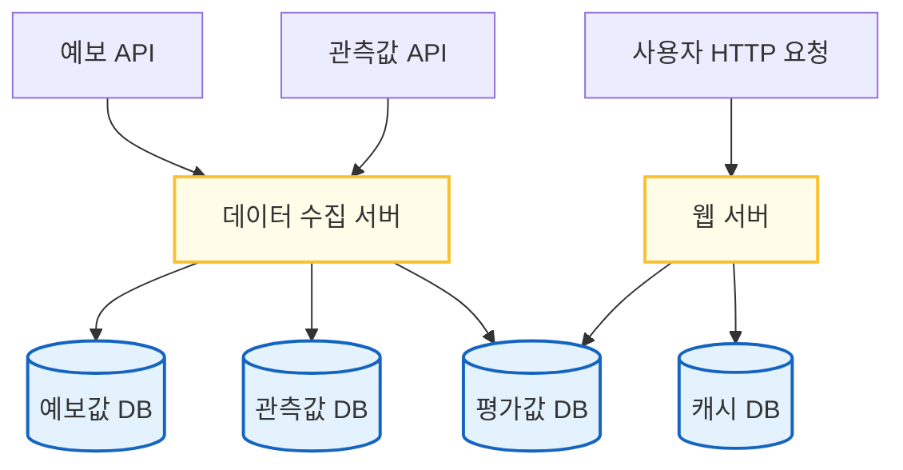
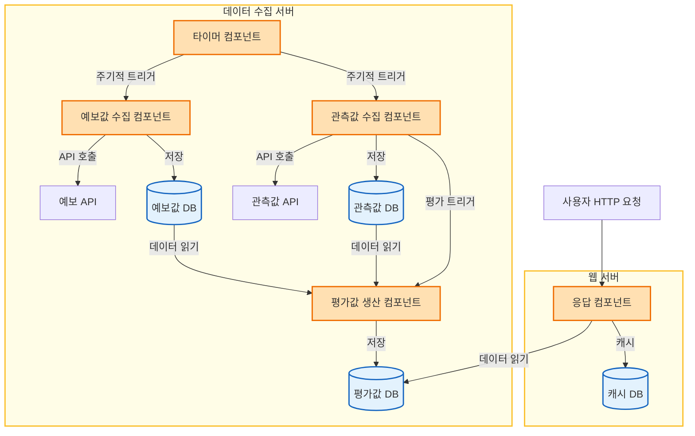
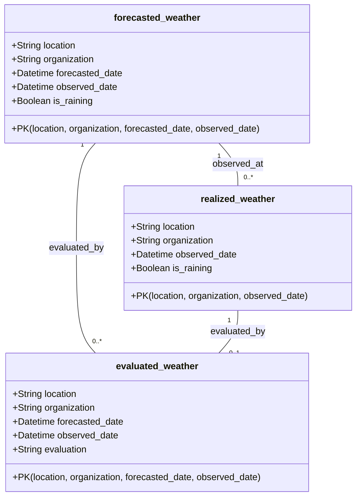

# Wrong Weather Forecast

## 1. 프로젝트 개요

- **목표:**  
  - 한국 기상청의 예보가 실제로 얼마나 정확한지, 실시간으로 시각화하는 웹사이트 개발

- **핵심 기능:**  
  - 예보값과 실제값의 차이를 산출  
  - 신뢰도를 직관적으로 사용자에게 제공

---

## 2. 용어 정의

- **예보 지역 ($L$, forecasted location):**  
  - 예보가 적용되는 지역

- **예보시점 ($t$, forecasted time):**  
  - 예보가 발표된 시점

- **관측시점 ($T$, observed time):**  
  - 실제 날씨가 관측된 시점

- **시점차 ($\Delta$, time delta)**
  - 예보시점과 관측시점의 차이. $\Delta = T - t$와 같음.

- **예보값 ($F_L(t, T)$, forecasted value):**  
  - $t$ 시점에 발표된, $T$ 시점 $L$ 지역의 예보된 날씨

- **관측값 ($F_L^*(T)$, observed value):**  
  - $T$ 시점에 실제로 관측된 $L$ 지역의 날씨

- **예보목록 ($f_{L,T}$, forecasted list)**
  - $T$ 시점 $L$ 지역을 예보한 모든 예보의 모음
  - $f_{L, T} = \{ \forall t | F_L(t,T) \}$

- **평가값 ($P(f_{L,T}, F_L^*(T))$, forecast evaluation)**
  - $T$ 시점 $L$ 지역의 관측값과 비교해, 예보목록이 얼마나 정확했는지를 평가한 결과

---

## 3. 아키텍처 설계

### 3.1. 배포 관점 정의

- **표기법**
  - 서버: 노란색 직사각형
  - 서버 내 컴포넌트: 주황색 직사각형
  - 데이터베이스: 파란색 원기둥
  - 외부 에이전트: 보라색 직사각형



### 3.2. 흐름 관점 정의



### 3.3. 인터페이스 관점 정의

#### 3.3.1. 데이터 수집 서버

| 엔드포인트 | 메서드 | 설명                                                |
| ---------- | ------ | --------------------------------------------------- |
| 없음       | -      | 데이터 수집 서버의 책임은 평가값 DB 업데이트에 그침 |

#### 3.3.2. 웹 서버

| 엔드포인트                       | 메서드 | 설명                                                                                            |
| -------------------------------- | ------ | ----------------------------------------------------------------------------------------------- |
| `/web/{organization}`            | GET    | 전국 모든 지역에 대해 `{organization}`이 보도한 예보와 최근 관측값을 비교한 평가 결과를 반환    |
| `/web/{organization}/{location}` | GET    | `{organization}`이 `{location}`에 대해 보도한 예보와 최근 여러 관측값을 비교한 평가 결과를 반환 |

- `/web/{organization}`
  - **설명**:  
    - 전국 각 지역별로 `{organization}`이 발표한 예보와, 최근 관측값을 비교한 평가 결과를 제공
  - **요청 예시**:  
    - `GET /web/kma`
  - **응답 예시**:
    - `200 OK`
    ```json
    {
      "organization_code": "kma",
      "organization_text": "기상청",
      "observed_date": "2024-04-27T09:00:00+09:00",
      "locations": [
        {
          "location_code": "seoul",
          "location_text": "서울",
          "evaluation": "true_positive"
        },
        {
          "location_code": "daejeon",
          "location_text": "대전",
          "evaluation": "false_positive"
        },
        ...
      ]
    }
    ```

- `/web/{organization}/{location}`
  - **설명**:  
    - 특정 `{organization}`이 `{location}`에 대해 발표한 여러 예보와, 최근 관측값들을 비교한 평가 결과를 제공
  - **요청 예시**:  
    - `GET /web/kma/seoul`
  - **응답 예시**:
    - `200 OK`
    ```json
    {
      "organization_code": "kma",
      "organization_text": "기상청",
      "location_code": "seoul",
      "location_text": "서울",
      "histories": [
        {
          "observed_date": "2024-04-27T09:00:00+09:00",
          "evaluation": "true_negative"
        },
        {
          "observed_date": "2024-04-27T06:00:00+09:00",
          "evaluation": "false_negative"
        },
      ]
    }
    ```
  
### 3.4. 데이터 관점 정의



- **RDBMS 데이터베이스**
  - 예보값 테이블 `forecasted_weather`
    - `location` (String): 예보지역
    - `organization` (String): 예보기관
    - `forecasted_date` (Datetime): 예보의 예보시점
    - `observed_date` (Datetime): 예보의 관측시점
    - `is_raining` (Boolean): 비가 오는가?
    - PK: `(location, organization, forecasted_date, observed_date)`
    - Index: PK, `location`, `organization`, `forecasted_date`, `observed_date`
  - 관측값 테이블 `realized_weather`
    - `location` (String): 예보지역
    - `organization` (String): 예보기관
    - `observed_date` (Datetime): 관측시점
    - `is_raining` (Boolean): 비가 오는가?
    - PK: `(location, organization, observed_date)`
    - Index: PK, `location`, `organization`, `observed_date`
  - 평가값 테이블 `evaluated_weather`
    - `location` (String): 예보지역
    - `organization` (String): 예보기관
    - `observed_date` (Datetime): 관측시점
    - `evaluation` (String): 평가 결과는?
    - PK: `(location, organization, forecasted_date, observed_date)`
    - Index: PK, `location`, `organization`, `observed_date`
- **인메모리 데이터베이스**
  - 키
    - `/web/{organization}`: `/web/{organization}` 대응 캐시
    - `/web/{organization}/ㅋ{location}`: `/web/{organization}/{location}` 대응 캐시

### 3.5. 알고리즘 관점 정의


---

## 4. 주요 디자인 결정

### 4.1. 평가 기준

- **이산적 척도:**  
  - 맑음, 흐림, 눈, 비 등  
- **연속적 척도:**  
  - 기온, 습도, 풍속 등  
- **평가 방식:**  
  - 예보값이 실제값과 맞았는지 틀렸는지 판정하는 방법은?
  - 이산적(맞음/틀림) vs 연속적(정확도 점수화) 평가 중 무엇을 사용?
  - 예보목록 하나에도 여러 예보시점이 있는데 그 중 무슨 예보시점으로 평가?

### 4.2. 미래 확장성에 대한 고려

- **확장 가능한 기능**
  - 여러 기상청의 예보를 비교하고 각각 점수 산출
  - 강우예보 외의 예보에도 점수 산출
    - 특히 국민생활과 밀접한 강설예보, 풍랑예보, 태풍경로예보, 폭염/한파예보
  - 예보점수의 이메일 또는 알림 구독기능

---

## 5. 참고자료

[기상청 ‘3시간 간격 동네예보’ 5일간 정확도 따져보니 - 동아사이언스](https://www.dongascience.com/news.php?idx=-13339)
[2024 수치예보시스템의 검증 - 기상청 수치모델링센터](https://www.weather.go.kr/download_01/forecast_report/report_2024.pdf)
[기상청 단기예보 API](https://www.data.go.kr/data/15084084/openapi.do?recommendDataYn=Y)

[OpenMeteo API](https://open-meteo.com/en/features#available-apis)